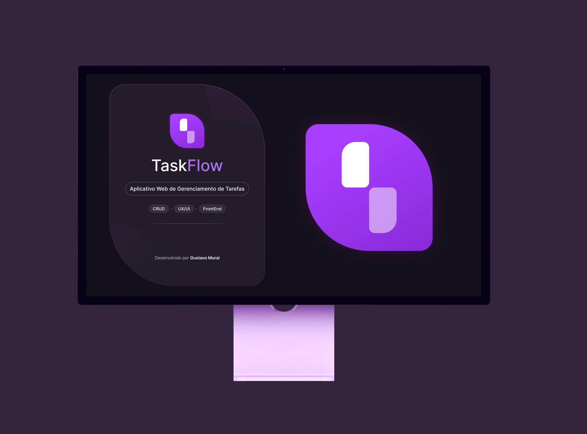

<!-- Banner Personalizado -->

<h2> Tecnologias Utilizadas</h2>

  

    <table>
      <tr>
        <td align="center" style="padding:10px 18px;">
           
          <b>Figma</b>
        </td>
        <td align="center" style="padding:10px 18px;">
           
          <b>HTML5</b>
        </td>
        <td align="center" style="padding:10px 18px;">
           
          <b>CSS3</b>
        </td>
        <td align="center" style="padding:10px 18px;">
           
          <b>JavaScript</b>
        </td>
        <td align="center" style="padding:10px 18px;">
           
          <b>React</b>
        </td>
        <td align="center" style="padding:10px 18px;">
           
          <b>Angular</b>
        </td>
      </tr>
    </table>
  

---

## 🎨 **Projetos UX/UI**

<table align="center">
  <tr>
    <td align="center">
      
       <small>App de cafeteria</small> <small><i>UX Research • Design System • Prototipagem</i></small>
    </td>
    <td align="center">
      
       <small>Jogo educativo para crianças</small> <small><i>UI Design • Acessibilidade • Design Responsivo</i></small>
    </td>
    <td align="center">
      
       <small>App mobile de doações</small> <small><i>Design Thinking • UCD • Microinterações</i></small>
    </td>
  </tr>
</table>

---

## 💻 **Projetos Front-End**

<table align="center">
  <tr>
    <td align="center">
      
       <small>App de Previsão do Tempo</small> <small><i>HTML • CSS • JavaScript • PWA</i></small>
    </td>

  <td align="center">
      
       <small>Gestão de Tarefas</small> <small><i>Angular • TypeScript • SPA</i></small>
    </td>

  <td align="center">
      
       <small>CRUD de Tarefas</small> <small><i>React • JavaScript • Componentização</i></small>
    </td>
  </tr>
</table>

---

## 📊 **Linguagens mais utilizada**

  
  

---

## 👤 **Sobre Mim**

- 🎨 UX/UI Designer com experiência em design centrado no usuário e design system.  
- 🧠 Experiência com análise de dados e dashboards interativos (Power BI, SQL Server).  
- 💡 Familiaridade com metodologias Design Thinking, UCD, Scrum e Kanban.  
- 💬 Inglês avançado (B2+).

---

## 📜 **Formação, Certificações & Cursos**

- 🎓 **Análise e Desenvolvimento de Sistemas** – IFSP (2024 – 2026)  
- 🎓 **Formação UX Design** – Alura (2025)  
- 🎓 **Google Data Analytics** – Coursera (2025)  
- 💻 **Figma: Design de Interfaces** – Udemy  
- 🧭 **Metodologias Ágeis (Scrum e Kanban)** – Udemy  
- 📊 **SQL Server e Power BI** – Udemy  
- 📈 **Excel Avançado** – Udemy

---

## 📌 **Onde Me Encontrar**

  
  
  

  

---

  

  💜 Obrigado por visitar meu perfil!  
  ✨ <b>“Design é onde forma e função se encontram.”</b>

