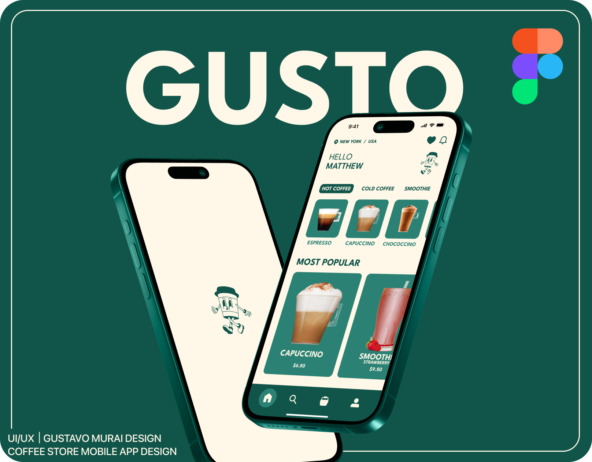
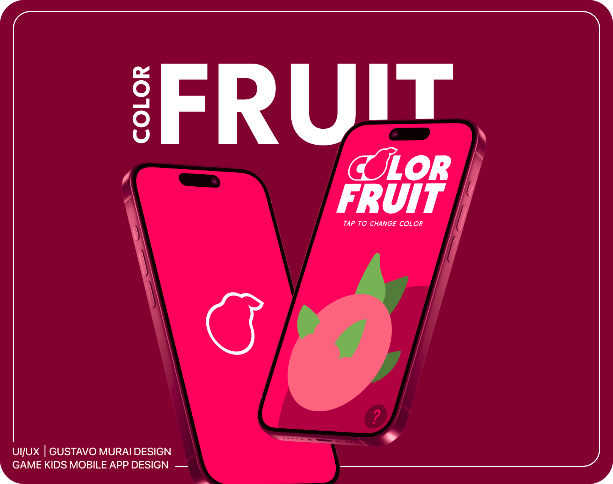

<!-- Banner Personalizado -->

# 🫰 Olá, Eu sou o Gustavo Murai

## 🎯 **Objetivo Profissional**
Apaixonado por design e experiência do usuário, busco criar interfaces intuitivas e visualmente atraentes. Meu objetivo é desenvolver produtos que proporcionem experiências incríveis para os usuários, aliando estética e funcionalidade.

## 🛠️ **Tecnologias & Ferramentas**

  <table style="border: 3px solid #8A2BE2; border-radius: 5px;">
    <tr>
      <td align="center" style="border: 3px solid #8A2BE2; border-radius: 10px; padding: 10px;">
        
         <b>Figma</b> <small>UI/UX Design</small>
      </td>
      <td align="center" style="border: 3px solid #8A2BE2; border-radius: 10px; padding: 10px;">
        
         <b>Adobe XD</b> <small>UI/UX Design</small>
      </td>
      <td align="center" style="border: 3px solid #8A2BE2; border-radius: 10px; padding: 10px;">
        
         <b>HTML5</b> <small>Front-End</small>
      </td>
      <td align="center" style="border: 3px solid #8A2BE2; border-radius: 10px; padding: 10px;">
        
         <b>CSS3</b> <small>Estilização</small>
      </td>
      <td align="center" style="border: 3px solid #8A2BE2; border-radius: 10px; padding: 10px;">
        
         <b>JavaScript</b> <small>Interatividade</small>
      </td>
    </tr>
  </table>

#

<h3 align="left">Projetos UX/UI</h3>

<table>
  <tr>
    <td align="center">
      <a href="https://www.behance.net/gallery/220600085/Coffee-Shop-Mobile-App-Design-UXUI" target="_blank">
        
         <strong>Gusto Coffee Mobile App</strong>
      </a>
    </td>
    <td align="center">
      <a href="https://www.behance.net/gallery/220630751/Color-Fruit-Kids-Game-Design-UXUI" target="_blank">
        
         <strong>Color Fruit Design Game App</strong>
      </a>
    </td>
  </tr>
</table>

## 🎨 **Projetos UX/UI**
- ☕ [Coffee Shop Mobile App Design (Figma)](https://www.behance.net/gallery/220600085/Coffee-Shop-Mobile-App-Design-UXUI) — App de cafeteria urbana, focado na melhor experiência do usuário ao pedir café.  
- 🎮 [Color Fruit - Kids Game Design (Figma)](https://www.behance.net/gallery/220630751/Color-Fruit-Kids-Game-Design-UXUI) — Jogo educativo para crianças explorarem frutas e suas cores de forma interativa.
- 📈 CRUD for employees — *Em andamento*.

---

## 💻 **Projetos Front-End** ( todas informações disponível nos repositório )
- 🌤️ [App de Previsão do Tempo](https://gustavomurai.github.io/Climatempo-aplicativo/) — Consulta de clima por cidade com design responsivo, dark mode e suporte PWA.   
- 📦 App de Lista de Tarefas — *Em andamento*.  
- 📈 Dashboard de Análises — *Em andamento*.

---

## 📊 **Estatísticas do GitHub**
🌟 Essas métricas mostram minha dedicação diária e constante evolução como dev!  

  
  

---

## 📜 Graduação, Certificações & Cursos 
- Graduação em Análise e Desenvolvimento de Sistemas - IFSP  
- Google UX Design - Coursera & Google  
- Figma para Design de Interfaces e User Experience - Udemy  
- Web Design Completo - Udemy  
- UX Research - Domestika  

---

## 📌 **Onde Me Encontrar**

  

---

<!-- Contador de visitas -->

  

  💜 Obrigado por visitar meu perfil!

