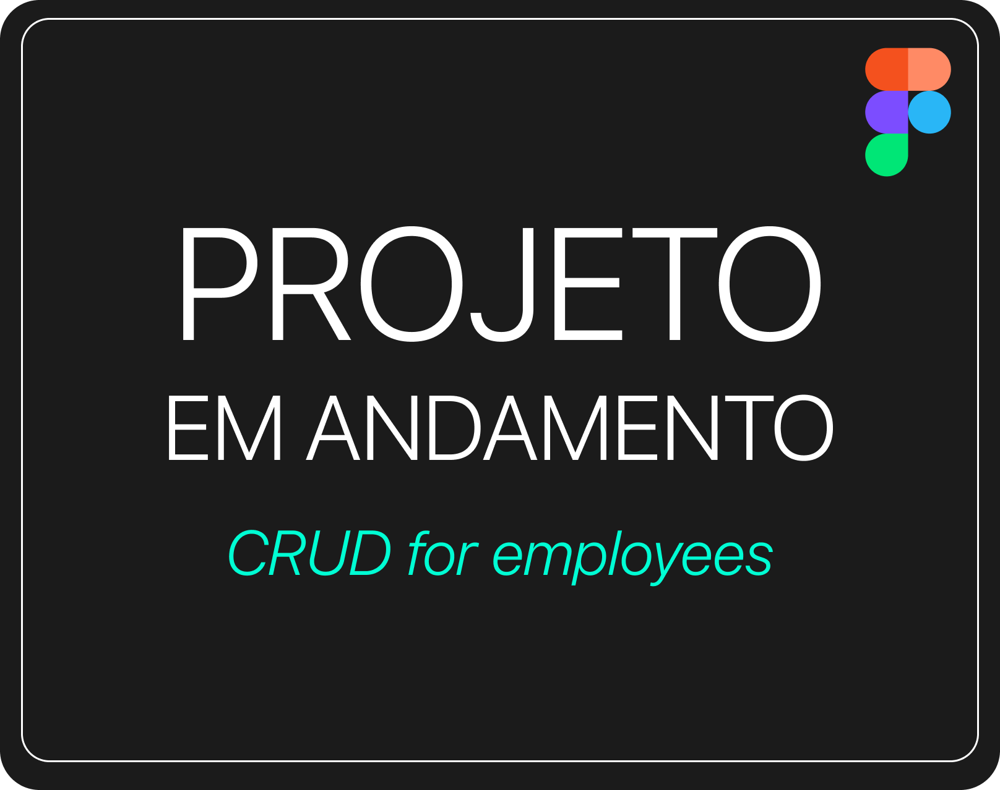

<!-- Banner Personalizado -->

# 🫰 Olá, Eu sou o Gustavo Murai

**Objetivo Profissional**  
Apaixonado por design e experiência do usuário, busco criar interfaces intuitivas e visualmente atraentes.  
Meu objetivo é desenvolver produtos que proporcionem experiências incríveis para os usuários, aliando estética e funcionalidade.

---

<!-- Tecnologias & Ferramentas -->
## 🚀 **Tecnologias & Ferramentas**

  <table style="border-collapse: collapse;">
    <tr>
      <td align="center" style="padding: 10px;">
        
         <b>Figma</b> <small>UI/UX Design</small>
      </td>
      <td align="center" style="padding: 10px;">
        
         <b>Adobe XD</b> <small>UI/UX Design</small>
      </td>
      <td align="center" style="padding: 10px;">
        
         <b>HTML5</b> <small>Front-End</small>
      </td>
      <td align="center" style="padding: 10px;">
        
         <b>CSS3</b> <small>Estilização</small>
      </td>
      <td align="center" style="padding: 10px;">
        
         <b>JavaScript</b> <small>Interatividade</small>
      </td>
    </tr>
  </table>

---

---

<!-- Projetos UX/UI -->
## 🎨 **Projetos UX/UI**

  
  
  

---

<!-- Projetos Front-End -->
## 💻 **Projetos Front-End**

*todas informações disponíveis nos repositórios*

- 🌤️ [App de Previsão do Tempo](https://gustavomurai.github.io/Climatempo-aplicativo/) — Consulta de clima por cidade com design responsivo, dark mode e suporte PWA.  
- 📦 App de Lista de Tarefas — *Em andamento*.  
- 📈 Dashboard de Análises — *Em andamento*.

---

<!-- GitHub Stats -->
## 📊 **Estatísticas do GitHub**

🌟 Essas métricas mostram minha dedicação diária e constante evolução como dev!

  
  

---

<!-- Formação -->
## 📜 **Graduação, Certificações & Cursos**

- Graduação em Análise e Desenvolvimento de Sistemas - IFSP  
- Google UX Design - Coursera & Google  
- Figma para Design de Interfaces e User Experience - Udemy  
- Web Design Completo - Udemy  
- UX Research - Domestika  

---

<!-- Contatos -->
## 📌 **Onde Me Encontrar**

  
  
  
  

  

---

<!-- Contador de visitas -->

  

  💜 Obrigado por visitar meu perfil!

